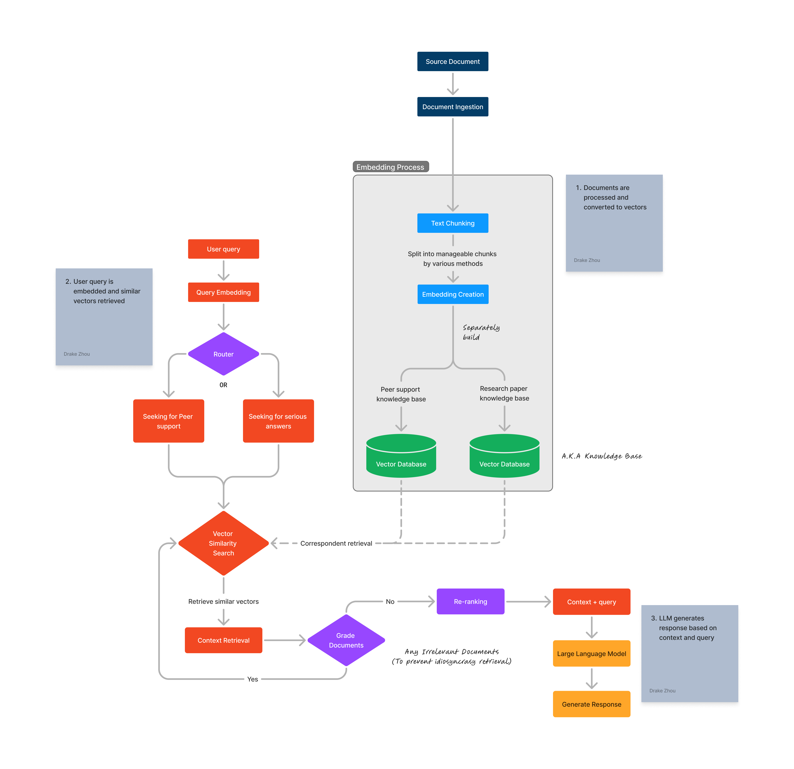

# CaLM - Caregiving Large Language Model

An intelligent RAG (Retrieval-Augmented Generation) system designed to assist caregivers of patients with Alzheimer's Disease and Related Dementias (ADRD). This system leverages local LLMs through Ollama and Langchain to provide contextual, accurate, and helpful information for family caregivers.



## 🌟 Features

- **Specialized Knowledge Base**: Curated information focused on ADRD caregiving
- **Local LLM Integration**: Uses Ollama for privacy-focused, local language model inference
- **Advanced RAG Pipeline**: Implements sophisticated retrieval-augmented generation for accurate responses
- **PubMed Integration**: Automatic retrieval of latest research and medical information
- **Vector Store**: Efficient storage and retrieval of embeddings using Chroma DB

## 📁 Project Structure

```
.
├── src/
│   ├── embedding/
│   │   ├── embedding_models.py    # Embedding model implementations
│   │   ├── vector_store.py        # Vector store operations
│   │   ├── chunking.py           # Text chunking utilities
│   │   └── script_vectorize.ipynb # Vectorization notebook
│   ├── ingestion/
│   │   └── pubmed_auto_search.py  # PubMed data ingestion
│   └── answer_generation.py       # Main RAG pipeline
├── data/
│   ├── raw_content/              # Raw knowledge base content
│   └── vector_database/          # Chroma DB storage
└── logs/                         # System logs
```

## 🚀 Getting Started

### Prerequisites

- Python 3.11+
- Ollama installed locally
- Required Python packages (install via pip):
  - langchain
  - chromadb
  - pandas
  - numpy
  - transformers

### Installation

1. Clone the repository:
```bash
git clone [repository-url]
cd LangchainRag_Ollama
```

2. Create and activate a virtual environment:
```bash
python -m venv env
source env/bin/activate  # On Windows: env\Scripts\activate
```

3. Install dependencies:
```bash
pip install -r requirements.txt
```

4. Start Ollama service locally

## 💡 Usage

1. **Data Ingestion**:
   - Place your knowledge base documents in `data/raw_content/`
   - Run the vectorization script to process documents
   - Use PubMed auto-search for latest research updates

2. **Query the System**:
   - Use the main notebook or Python interface
   - Get contextual responses based on the knowledge base
   - Access medical information and caregiving advice

## 🔒 Privacy & Security

- All processing is done locally
- No sensitive data is sent to external services
- Secure storage of medical and personal information

## 🤝 Contributing

Contributions are welcome! Please feel free to submit a Pull Request.

## 📝 License

This project is licensed under the MIT License - see the LICENSE file for details.

## 🙏 Acknowledgments

- Healthcare professionals and caregivers who provided domain expertise
- Open-source community for tools and libraries
- Research papers and medical resources that form our knowledge base
